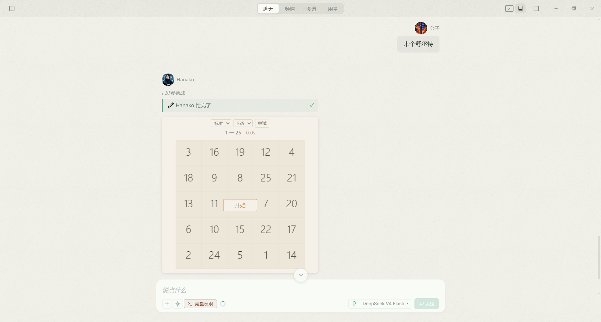
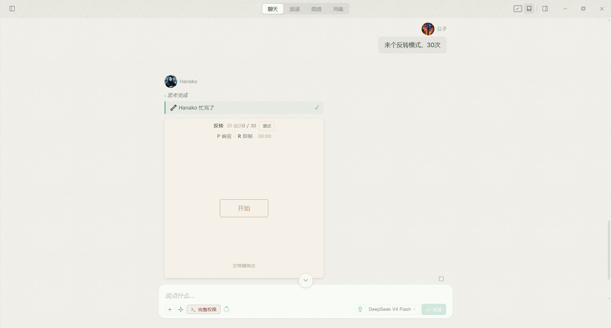
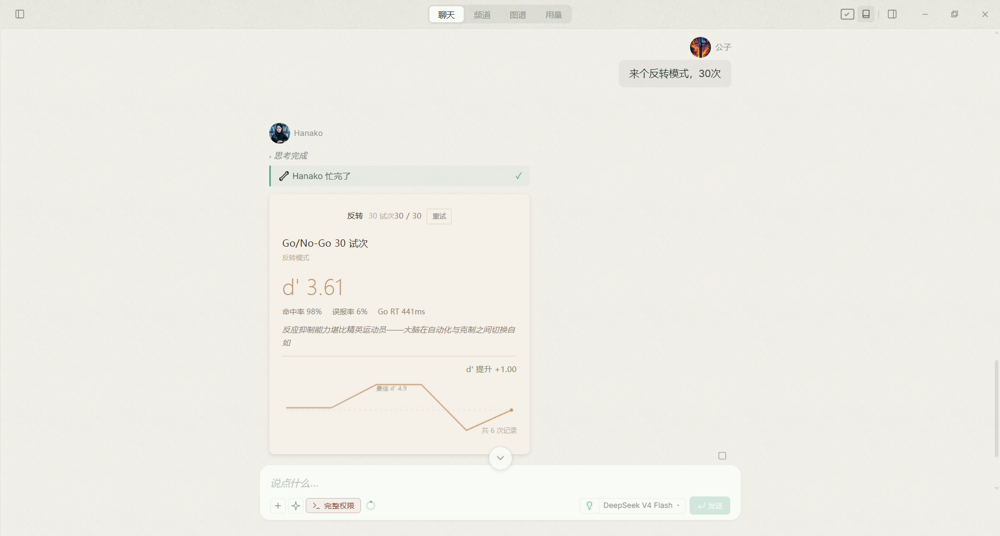
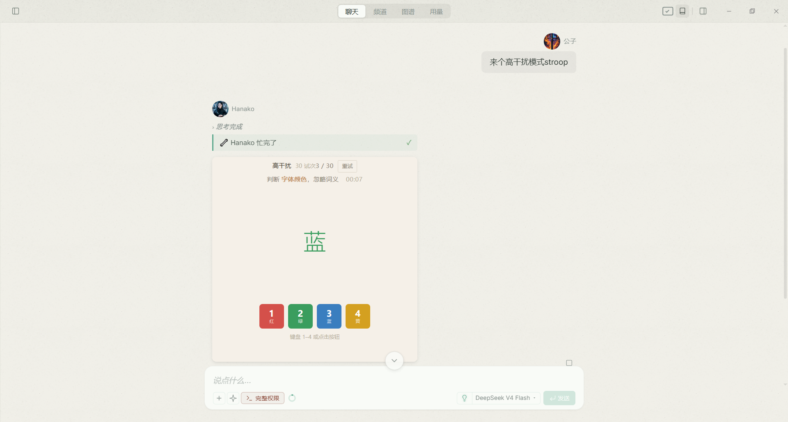
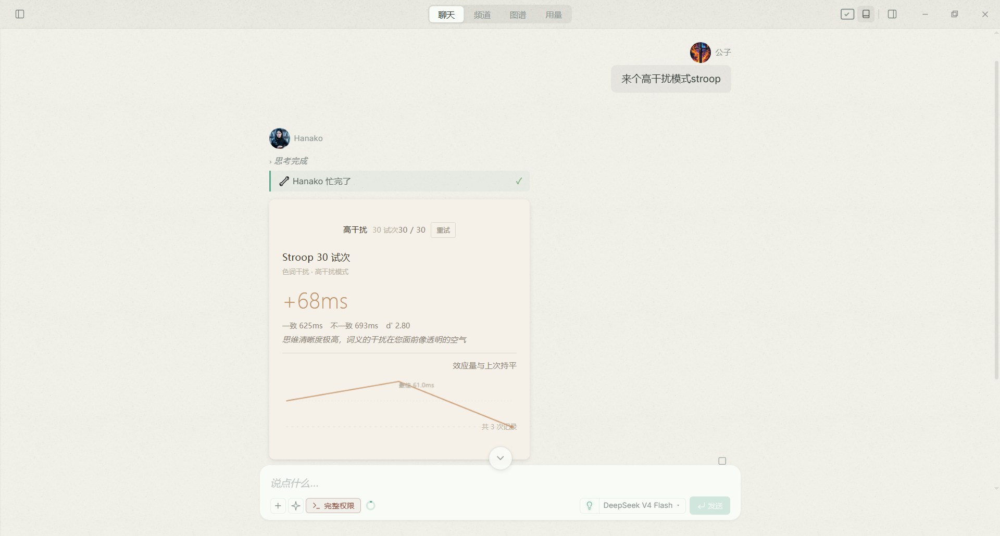

# 脑力热身（Brain Gym）

认知训练小游戏插件，集成在 HanaAgent 对话流中以 iframe 卡片形式交互。目前已实现三款游戏，覆盖注意力广度、反应抑制和干扰抑制三个核心认知维度。

## 快速上手

### 开始游戏

在对话中说：

| 你说 | 效果 |
|------|------|
| "来一局舒尔特" | 5×5 舒尔特表格 |
| "舒尔特 6×6" | 6×6 舒尔特表格 |
| "来个 Go/No-Go" | 标准模式 30 试次 |
| "Go/No-Go 反转 50" | 反转模式 50 试次 |
| "来个 Stroop" | 标准模式 30 试次 |
| "Stroop 高干扰" | 高干扰模式 30 试次 |
| "脑力热身" / "练练脑子" | 查看可用游戏 |

Agent 会返回一张 iframe 卡片，在卡片内完成游戏后自动保存结果。

### 查看分析

在对话中说：

| 你说 | 效果 |
|------|------|
| "查看训练分析" | 全部游戏的综合统计 |
| "舒尔特分析" | 只看舒尔特表格的数据 |
| "最近 10 局" | 只看最近 10 次记录 |
| "分析我的表现" | 输出详细的训练报告 |

### 数据存储

每次游戏结束后，结果通过两条独立路径保存：

1. **本地（localStorage）**：零延迟读取，用于卡片内即时展示结果和历史趋势
2. **服务端（JSONL）**：写入 `<plugin-data>/brain-gym/scores.jsonl`，供 `training_analysis` 工具和 Agent 分析使用

丢失历史数据后，在新 session 中完成一局新游戏即可重新积累记录。

## 已实现游戏

### 舒尔特表格（Schulte Grid）

注意力广度与视觉搜索速度测试。数字网格按升序点击，计时完成。支持标准模式和记忆模式（游戏内右上角切换）。

| 参数 | 说明 |
|------|------|
| `size` | 5 / 6 / 7（默认 5），网格行/列数 |
| `mode` | 游戏内右上角下拉菜单切换 `standard` / `memory`

#### 界面截图

开始界面 | 结果界面
:------:|:------:
 | 


### Go/No-Go

反应抑制与冲动控制测试。75% P（按键）/ 25% R（不按）字母序列，建立按键惯性后要求克制不响应。30 试次约 1 分钟。

| 参数 | 说明 |
|------|------|
| `size` | 30 / 50 / 70（默认 30），试次数 |
| `mode` | `standard` / `reversal`（默认 standard） |

- **standard**：全程 P=按键 R=不按
- **reversal**：半程后 P/R 角色互换，增加认知灵活性负荷

#### 界面截图

开始界面 | 结果界面
:------:|:------:
 | 

### Stroop 色词（Stroop）

干扰抑制与前扣带回认知控制测试。判断字体颜色（忽略词义），按对应颜色键（1=红 2=绿 3=蓝 4=黄）。30 试次约 1.5 分钟。

| 参数 | 说明 |
|------|------|
| `size` | 30 / 50 / 70（默认 30），试次数 |
| `mode` | `standard` / `enhanced`（默认 standard） |

- **standard**：50% 一致 / 50% 不一致
- **enhanced**：25% 一致 / 75% 不一致（更高干扰负荷）

#### 界面截图

开始界面 | 结果界面
:------:|:------:
 | 


### 调用方式

```js
start_game({ game: "schulte" })
start_game({ game: "schulte", params: { size: 6 } })
start_game({ game: "gonogo" })
start_game({ game: "gonogo", params: { size: 50, mode: "reversal" } })
start_game({ game: "stroop" })
start_game({ game: "stroop", params: { size: 70, mode: "enhanced" } })
```

## 结果与评价

每次游戏结束后展示：

- 主指标大字（Schulte 计时秒数 / Go/No-Go 的 d-prime / Stroop 效应量）
- 评价等级 S/A/B/C/D 及对应点评
- 与上次的对比（时间差异、d-prime 变化或效应量变化）
- 趋势曲线（≥3 次后出现）

### 评价标准

**舒尔特表格**（用时秒数，越低越好）：

| 等级 | 5×5 标准 | 5×5 记忆 | 6×6 标准 | 6×6 记忆 | 7×7 标准 | 7×7 记忆 |
|------|----------|----------|----------|----------|----------|----------|
| S | ≤20 | ≤26 | ≤28 | ≤36 | ≤80 | ≤104 |
| A | ≤28 | ≤36 | ≤40 | ≤52 | ≤105 | ≤137 |
| B | ≤38 | ≤49 | ≤55 | ≤72 | ≤135 | ≤176 |
| C | ≤55 | ≤72 | ≤75 | ≤98 | ≤170 | ≤221 |

**Go/No-Go**（基于 d-prime，越高越好）：

| 等级 | 标准模式 | 反转模式 |
|------|----------|----------|
| S | ≥3.0 | ≥2.7 |
| A | ≥2.5 | ≥2.2 |
| B | ≥2.0 | ≥1.7 |
| C | ≥1.5 | ≥1.2 |

**Stroop 色词测试**（Stroop 效应量 ms，越小越好）：

| 等级 | 标准模式 | 高干扰模式 |
|------|----------|------------|
| S | ≤50ms | ≤80ms |
| A | ≤150ms | ≤200ms |
| B | ≤250ms | ≤350ms |
| C | ≤400ms | ≤550ms |

效应量 = 不一致 RT − 一致 RT。负值表示不一致条件下反而更快（高强度训练者可能出现）。

## 架构

```
brain-gym/
├── config.json             游戏注册表
├── manifest.json           插件元信息
├── index.js                插件生命周期
├── routes/
│   ├── game.js             iframe 渲染 + 结果接收
│   └── game-page.js        HTML 模板生成
├── tools/
│   ├── start-game.js       Agent 出题工具
│   └── analysis.js         训练分析工具
├── lib/
│   └── storage.js          文件读写
├── assets/games/
│   ├── shared/
│   │   ├── evaluations.js  评价阈值 + 词库
│   │   └── results.js      评价引擎 + 图表 + 数据提交
│   ├── schulte/game.js     舒尔特表格
│   ├── gonogo/game.js      Go/No-Go
│   └── stroop/game.js      Stroop 色词
├── docs/
│   ├── ARCHITECTURE.md
│   ├── CONTEXT.md
│   ├── DESIGN.md
│   ├── DESIGN-go-nogo.md
│   └── ANALYSIS-TEMPLATE.md
├── skills/brain-gym/
│   ├── SKILL.md
│   └── references/
│       └── ANALYSIS-TEMPLATE.md
├── config.json
├── manifest.json
├── index.js
├── README.md
└── AGENTS.md
```

### 关键设计

- **双存储**：前端 localStorage + 服务端 JSONL。localStorage 零延迟读历史，JSONL 供 `training_analysis` 工具和跨 session Agent 分析使用
- **config 即注册表**：新游戏只在 `config.json` 注册 + 创建 `game.js` + 追加评价数据，无需改多处代码
- **评价引擎与数据分离**：`evaluations.js` 只存阈值和词库，`results.js` 提供通用 `evaluate()` / `pickComment()` / `drawTrendChart()`
- **数据提交链路**：`game.js` → `BrainGym.saveScore()` → 同时存 localStorage 和调 `window.__submitGameResult()` → `fetch POST /api/plugins/{id}/game/result` → 写入 `scores.jsonl`
- **暖纸色系**：所有游戏共享同一套配色（米白底、深棕墨、旧黄铜强调、灰绿成功、暗玫错误），避免冷黑或荧光

## 开发

### 添加新游戏

1. 在 `config.json` 的 `games` 下注册，`implemented: true`
2. 在 `assets/games/xxx/` 创建 `game.js`，IIFE 模式实现 `{ container, size, token, pluginId }` 构造器
3. 在 `shared/evaluations.js` 追加阈值、词库和标签
4. 在 `game-page.js` 添加 `if (game === "xxx")` 分发分支
5. 更新 `start-game.js` 工具描述和 `SKILL.md`

### 调试

插件开发模式下使用 Hana 的 dev slot 进行调试：

```bash
plugin_dev_install { sourcePath: "$PWD" }   # 安装 dev 版本
plugin_dev_reload { pluginId: "brain-gym" }  # 修改后重载
```

注意：`plugin_dev_reload` 从 **sourcePath** 同步到 dev 目录，所有源码修改必须在 sourcePath 下进行。

## 参考文献

### 舒尔特表格
- **Schulte, W. (1960s)**. 注意力诊断临床方法。舒尔特表格最初由德国心理治疗师 Walter Schulte 开发，用于注意力障碍的临床诊断，后成为神经心理学评估和认知训练的标准化工具。

### Go/No-Go
- **Bezdjian, S., et al. (2009)**. Assessing inattention and impulsivity in children during the Go/NoGo task. *British Journal of Developmental Psychology*, 27(2), 365–383. — P/R 字母刺激范式的标准参数（刺激 500ms、Go 比例 75–80%）。
- **Luria, A. R. (1960s)**. 前额叶损伤患者的临床观察。Go/No-Go 范式的原始来源，确立反应抑制作为执行功能核心指标的定位。
- **Donders, F. C. (1868)**. On the speed of mental processes. — Go/No-Go 范式的最早实验雏形（c-go/no-go 的区分）。

### 信号检测论与评分
- **Macmillan, N. A., & Creelman, C. D. (2005)**. *Detection Theory: A User's Guide* (2nd ed.). Lawrence Erlbaum. — d-prime (d') 标准算法：d' = Z(Hit Rate) − Z(False Alarm Rate)。
- **Hautus, M. J. (1995)**. Corrections for extreme proportions and their biasing effects on estimated values of d'. *Behavior Research Methods, Instruments, & Computers*, 27(1), 46–51. — 对数线性校正（log-linear correction），在命中率或误报率为 0/1 时加 0.5 避免 z 值发散。
- **Abramowitz, M., & Stegun, I. A. (1964)**. *Handbook of Mathematical Functions*. Dover. — 正态分位数函数的近似算法（误差 < 0.00045）。

### Stroop 色词
- **Stroop, J. R. (1935)**. Studies of interference in serial verbal reactions. *Journal of Experimental Psychology*, 18(6), 643–662. — Stroop 效应的原始发现：色词命名延迟由词义与颜色的语义冲突导致。
- **MacLeod, C. M. (1991)**. Half a century of research on the Stroop effect: An integrative review. *Psychological Bulletin*, 109(2), 163–203. — 50 年 Stroop 效应研究元分析，标准效应量约 200ms（健康成人）。
- **Ludwig, C., et al. (2010)**. The role of the anterior cingulate cortex in the Stroop task. — 不一致条件下前扣带回激活增大，前扣带回是干扰抑制的关键脑区。
